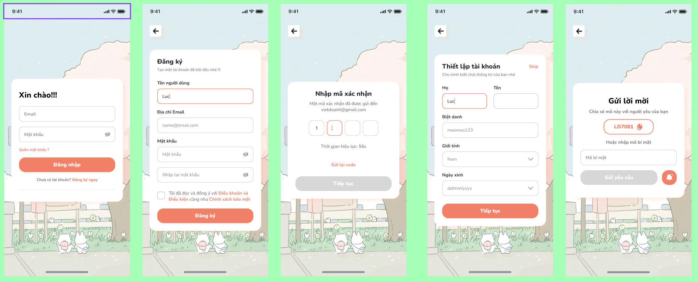
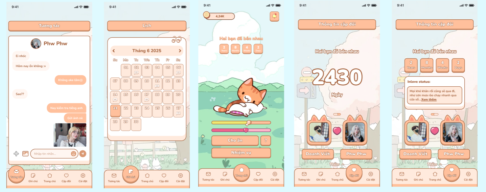

# Đếm Ngày "Xa" Nhau ## 


## Tổng quan

**Đếm Ngày "Xa" Nhau** là một ứng dụng di động được phát triển trên nền tảng Android, được thiết kế đặc biệt cho các cặp đôi. Ứng dụng không chỉ là một công cụ đếm ngày kỷ niệm mà còn là một không gian riêng tư, giúp các cặp đôi duy trì và vun đắp tình cảm thông qua các hoạt động tương tác thú vị, đặc biệt hữu ích cho các cặp đôi yêu xa.

## ✨ Tính năng nổi bật

Ứng dụng cung cấp một bộ công cụ toàn diện để các cặp đôi cùng nhau chia sẻ và tương tác:

| Tính năng | Mô tả chi tiết |
| :--- | :--- |
| **💌 Ghép đôi & Đồng bộ** | Người dùng có thể gửi lời mời ghép đôi cho "nửa kia" thông qua mã code duy nhất. Sau khi ghép đôi thành công, mọi dữ liệu và hoạt động sẽ được đồng bộ hóa giữa hai thiết bị. |
| **💖 Đếm ngày kỷ niệm** | Tự động đếm và hiển thị số ngày, tháng, năm bên nhau, cùng với các cột mốc kỷ niệm quan trọng sắp tới. |
| **🐱 Nuôi Pet ảo** | Cả hai sẽ cùng nhau chăm sóc một thú cưng ảo. Pet có các chỉ số về `độ đói` và `độ vui vẻ`, đòi hỏi sự tương tác thường xuyên từ cả hai người. Trạng thái của Pet được đồng bộ real-time qua Socket. |
| **🎯 Nhiệm vụ** | Hệ thống nhiệm vụ hàng ngày được thiết kế để tạo sự tương tác và tạo ra những kỷ niệm vui vẻ, cũng là cách kiếm coin mua thức ăn cho pet. |
| **💬 Nhắn tin** | Tích hợp tính năng nhắn tin mã hóa đầu cuối (E2EE) bằng AES, giúp cuộc trò chuyện trở nên riêng tư và gắn liền với các hoạt động khác. |
| **📔 Nhật ký chung** | Ghi lại những khoảnh khắc, cảm xúc và hình ảnh đáng nhớ. Mỗi ghi chú đều được chia sẻ và lưu giữ như một phần của câu chuyện tình yêu. |

## 📸 Giao diện ứng dụng
### Đăng nhập


### Màn hình chính & Tính năng


## �🛠️ Công nghệ sử dụng

- **Ngôn ngữ:** Kotlin  
- **Kiến trúc:** MVVM (Model–View–ViewModel)  
- **UI:** XML Layout, ViewBinding, Material Design  
- **Bất đồng bộ:** Coroutines  
- **Networking:** Retrofit (RESTful API)  
- **Realtime:** Socket.IO (chat)  
- **Database & Lưu trữ:** SharedPreferences, Cloudinary (hình ảnh)  
- **Thông báo:** Firebase Cloud Messaging  

## 🚀 Cài đặt và Chạy thử

Để chạy thử dự án trên máy của bạn, vui lòng làm theo các bước sau:

### 1. Yêu cầu
- Android Studio (phiên bản mới nhất)
- JDK 11 hoặc cao hơn

### 2. Cấu hình Firebase
1.  Truy cập [Firebase Console](https://console.firebase.google.com/) và tạo một dự án mới.
2.  Thêm một ứng dụng Android vào dự án Firebase với package name `com.example.hitproduct`.
3.  Tải xuống file `google-services.json` và đặt nó vào thư mục `app/` của dự án.
4.  Bật các dịch vụ cần thiết: **Cloud Messaging**.
5.  Tạo file AccessToken lưu trữ token của Firebase, đặt vào trong thư mục `common/util`.

### 3. Chạy ứng dụng
1.  Clone repository này về máy:
    ```bash
    git clone https://github.com/Quan0414/HIT-Product-2025.git
    ```
2.  Mở dự án bằng Android Studio.
3.  Đợi quá trình Sync Gradle hoàn tất.
4.  Chạy ứng dụng trên máy ảo hoặc thiết bị thật.

## 📞 Thông tin liên hệ

- **Tác giả:** Quan0414
- **GitHub:** [https://github.com/Quan0414](https://github.com/Quan0414)

---
*Dự án này là một phần của quá trình học tập và phát triển kỹ năng, thể hiện tâm huyết và nỗ lực trong việc tạo ra một sản phẩm có giá trị.*
